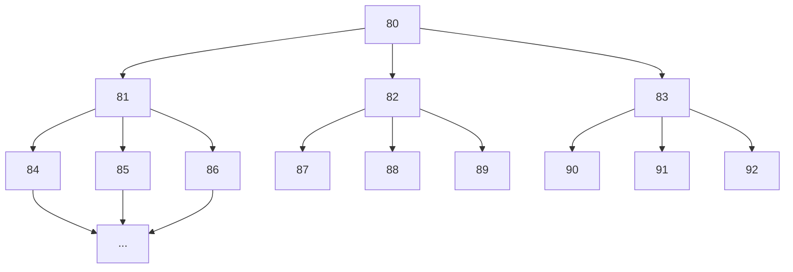

# Blockchain-Lab
Herzlich Willkommen!

## Einleitung
Dies ist die Realisierung einer einfachen Blockchain für das Modul Blockchain Lab des Studiengangs
Wirtschaftsinformatik und digitale Medien an der Hochschule der Medien im Sommersemester 2022. Das Projekt begann im Wintersemester 21/22 und wird im Sommesemester 2022 forgeführt. Es zeigt als Endprodukt eine einfache Implementierung einer Blockchain mit einem Peer-to-Peer Netzwerk.

## Inhalt
Wir haben zu Ihrer Unterstützung einige Markdown-Dokumente angelegt, die weitere Informationen
enthalten.

- [RUN.md](RUN.md) erklärt wie Sie die Blockhain und das Peer-to-Peer Netzwerk starten.
- [LICENSE.md](LICENSE.md) gibt lizenzrechtliche Hinweise.
- [/src](/src): In diesem Verzeichnis finden Sie den Source Code des Projekts.

## Folgende Funktionen sind prototypisch umgesetzt:
- Automatisches Peer-Discovery: Beim Start verbindet sich ein Node automatisch mit dem Rest des Netzwerkes
- Verteilte Validierung von Transaktionen, durch ein Protokoll angelehnt an das 2-Phase-Commit-Protokoll
- Transaktionen können über die Command-Line erstellt werden und werden an das ganze Netzwek gesendet und in der Blockchain aller Nodes gespecihert, wenn valide
- Invalide Transaktionen werden nicht von den Nodes gespeichert
- Transaktionen werden mit ECDSA-Keys signiert und können so jederzeit validiert werden
- Teile der Blockchain oder die ganze Blockchain von anderen Nodes können heruntergeladen werden, durch eine vereinfachte Version des Initial Block Downloads von Bitcoin
- Resynchronisation der Nodes nach einem Fork in bestimmten Situationen
- Implementierung eines rudimentären Proof-Of-Work Mechanismus
- Ansatz zur Optimierung des Proof-Of-Work, indem mithilfe statistischer Methoden versucht wird, sich der Ziel-Nonce anzunähern

## Folgende Funktionen sind noch nicht implementiert:
- Automatische Synchronisation der lokalen Transaktionen mit den anderen Nodes im Netzwerk
- Kommunikation von Nodes auf verschiedenen Hosts (aktuell läuft das gesamte Netzwerk nur lokal auf einer Maschine)
- Wenn eine Parent-Node offline geht, sind auch alle Child-Nodes offline (siehe Netzwerkaufbau unten)
- Host discovery im P2P-Netz (Host, der eine Liste mit verfügbaren Nodes pflegt)
- Implementierung eines Proof of Stake Mechanismus and Gegenstück zum Proof of Work

## Netzwerkaufbau

